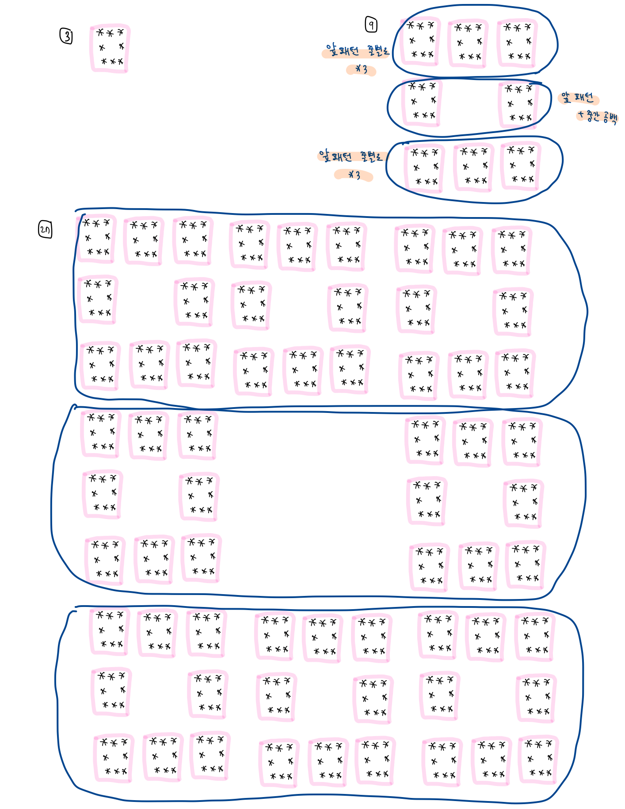

## 재귀호출

함수 안에서 함수 자기자신을 호출하는 방식

=> 종료 조건을 지정해 주어야 함.


ex)

```python
def hello(n):
    #종료조건
    if n == 0:
        return
    
    print('hello!', n)
    n -= 1
    hello(n)
    
hello(5)
```


## [BOJ2447 / 별 찍기 - 10]


### 문제

입력되는 수에 따라 일정의 패턴이 반복됨




### 내가 생각해준 방법

1. 패턴을 구상할 때 3파트로 나누어 구상한다.
2. 파트를 구상할 때는 이전 단계의 패턴을 적극 활용한다.
3. 각 파트는 이전 단계의 각 파트를 3배 해준 것과 같다.(중간 파트는 공백도 넣어줘야 한다.)


### 내가 짠 코드

(원리) 

- start를 3으로 두고, 하나의 패턴을 완성할 때마다 start를 3배씩 해준다.
- 3배씩 커진 start가 내가 입력받은 n값보다 커지면 재귀를 멈춘다.
- 하나의 패턴은 이전 패턴을 활용하며, 이전 패턴은 stars에 append 해준다.
- 일차원 배열 stars에 전체 패턴을 모두 저장해주어 손쉽게 꺼낼 수 있다.

```python
n = int(input())

#n=3일때부터 시작
start = 3
stars = ['***', '* *', '***']

def star(n, x):
    global start
    global stars

    #종료조건
    if n == 3:
        return

    #한번 돌때마다 패턴 초기화
    pattern = []

    #패턴을 만들어주기
    #위, 중간, 아래로 나누어서 만들어줌
    #일차원 배열에 모두 저장
    for i in stars:
        pattern.append(i*3)

    for i in stars:
        pattern.append(i+' '*start+i)

    for i in stars:
        pattern.append(i*3)
    
    #만든 패턴을 stars에 넣어주고 start 값 증가
    stars = pattern
    start *= 3

    #종료조건
    if start == n:
        return

    star(n, start)

star(n, 0)
for i in range(n):
    print(stars[i], end='\n')
```
