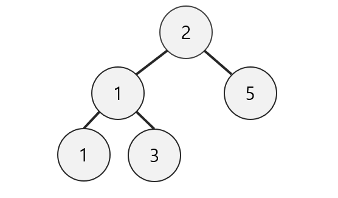

## 트리 자료구조

- 트리(Tree)는 정점(node)와 간선(edge)를 이용하여 데이터의 배치 형태를 추상화한 자료구조
- 데이터를 순차적으로 저장하s지 않는 비선형 자료구조
- 트리 순회
  - 전위 순회 : 루트 -> 왼쪽 자식 -> 오른쪽 자식
  - 중위 순회 : 왼쪽 자식 -> 루트 -> 오른쪽 순회
  - 후위 순회 : 왼쪽 자식 -> 오른쪽 순회 -> 루트


### 이진 트리 및 이진트리 순회

```python
#binary tree
class Node:
    #인스턴스를 생성하면 자동으로 실행되는 함수
    def __init__(self, data):
        self.data = data
        self.left = None
        self.right = None

    #인스턴스 자체를 출력할 때, 형식을 지정하는 함수
    # => 인스턴스가 문자열로 어떻게 표현될 지 결정해줌
    def __str__(self):
        return str(self.data)

class Tree:
    def __init__(self):
        self.root = None

    #preorder traversal
    #root -> left-> right
    #root 노드 먼저 출력
    #왼쪽 노드가 존재하면, 계속해서 왼쪽으로 이동하고
    #왼쪽 노드가 끝이 나면 오른쪽 노드부터 순회한다.
    def preorderTraversal(self, node):
        print(node, end = '')
        if not node.left == None : self.preorderTraversal(node.left)
        if not node.right == None : self.preorderTraversal(node.right)

    #inorder traversal
    #left -> root -> right
    def inorderTraversal(self, node):
        if not node.left == None : self.inorderTraversal(node.left)
        print(node, end = '')
        if not node.right == None : self.inorderTraversal(node.right)


    #postorder traversal
    #left -> right -> root
    def postorderTraversal(self, node):
        if not node.left == None : self.postorderTraversal(node.left)
        if not node.right == None : self.postorderTraversal(node.right)
        print(node, end = '')
    
    #root 만들기
    def makeRoot(self, node, left_node, right_node):
        if self.root == None:
            self.root = node
        node.left = left_node
        node.right = right_node

#name이라는 변수의 값이 main이라면, 아래의 코드를 실행하라.
# => 메인 함수의 선언, 시작을 의미
if __name__ == "__main__":
    node = []
    node.append(Node('-'))
    node.append(Node('*'))
    node.append(Node('/'))
    node.append(Node('A'))
    node.append(Node('B'))
    node.append(Node('C'))
    node.append(Node('D'))

    m_tree = Tree()
    for i in range(int(len(node)/2)):
        m_tree.makeRoot(node[i],node[i*2+1],node[i*2+2])

    print(       '전위 순회 : ', end='') ; m_tree.preorderTraversal(m_tree.root)
    print('\n' + '중위 순회 : ', end='') ; m_tree.inorderTraversal(m_tree.root)
    print('\n' + '후위 순회 : ', end='') ; m_tree.postorderTraversal(m_tree.root)
```


### 완전 이진 트리

- 완전이진트리는 트리의 높이가 h일 때, h-1층까지는 모든 노드들이 꽉 채워져있고, h번째 층의 값들은 왼쪽부터 차례로 채워져 있는 트리를 말한다.

  

  

```python
complete_binary_tree = [None, 2, 1, 5, 1, 3]
```

=> 각 노드에 2를 곱하거나 나눔으로써 해당 노드의 자식노드들과 부모노드의 위치를 구할 수 있음