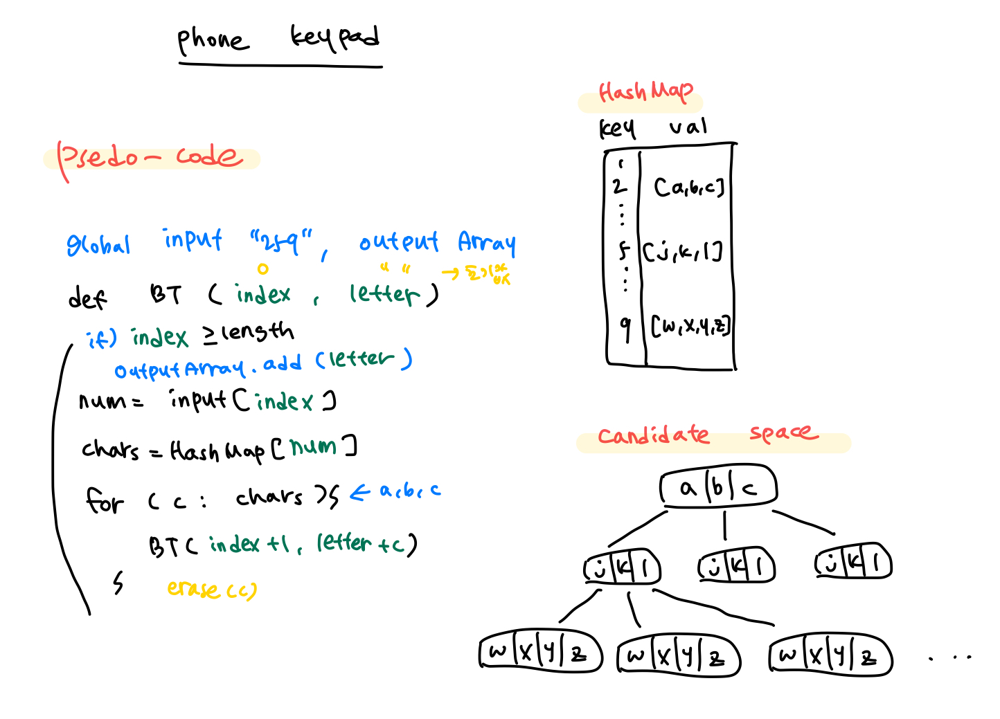

(문제 출제 이유 : 백트래킹 공부를 위해서)

### 백트래킹

탐색하는 과정에서, 더 나아갈 곳이 없다면, 이전의 경로로 돌아가서 다시 탐색




## [BOJ2961 / 도영이가 만든 맛있는 음식]


### 문제

- 음식의 신맛은 재료들의 신맛의 곱, 쓴맛은 재료들의 쓴맛의 합이다.

- 각 재료들의 신맛과 쓴맛이 주어졌을 때,

- 신맛과 쓴맛의 차가 최소가 되도록 음식의 재료를 선택하라.

  

### 내가 생각해준 방법

- 각 케이스별 신맛의 곱과 쓴맛의 합을 구해주고,
- 신맛과 쓴맛의 차를 전역변수에 담아준다.
- 전역변수에 담긴 차들 중, 가장 적은 값을 출력한다.


### 근데 생각해보니..

이걸 백트래킹으로 어떻게 구현할지 막막했다. 그냥 모든 조합들을 구하는 느낌이라서 백트래킹으로 어떻게 구할지 의문이 들었다. 

그러다가 파이썬 리스트의 모든 조합 구하는 것을 발견했다!


### 파이썬 리스트의 모든 조합 구하기

[하나의 리스트에서 모든 조합 구하기]

- permutations

  ```python
  from itertools import permutations
  
  items = ['1', '2', '3', '4', '5']
  list(permutations(items, 2))
  
  #[('1', '2'), ('1', '3'), ('1', '4'), ('1', '5'), ('2', '1'), ('2', '3'), ('2', '4'), ... ]
  ```

- combinations

  ```python
  from itertools import combinations
  
  items = ['1', '2', '3', '4', '5']
  list(combinations(items, 2))
  
  #[('1', '2'), ('1', '3'), ('1', '4'), ('1', '5'), ('2', '3'), ('2', '4'), ...]
  ```


[두개 이상의 리스트의 모든 조합 구하기]

- product

  ```python
  from itertools import product
  
  items = [['a', 'b', 'c,'], ['1', '2', '3', '4'], ['!', '@', '#']]
  list(product(*items))
  
  # [('a', '1', '!'), ('a', '1', '@'), ('a', '1', '#'), ('a', '2', '!'), ('a', '2', '@'), ('a', '2', '#'), ('a', '3', '!'), ('a', '3', '@'), ('a', '3', '#'), ('a', '4', '!'), ('a', '4', '@'), ('a', '4', '#'), ('b', '1', '!'), ... ]
  ```

  

=> product가 백트래킹이랑 비슷한 느낌이었고 내가 써야 하는 건 combinations 인 것 같았다!


### 헉 근데 코드를 짜다보니..

재료를 한개를 선택할 수도, 두개를 선택할 수도, 세개를 선택할 수도.. 있는거였다..!!


### 내가 짠 코드

(원리)

- 전체 리스트 중에서 한개~주어진 개수만큼 combinations를 활용해 조합들을 만들어주고,
- 각 조합들을 돌면서 신맛과 쓴맛의 차를 구하고, 이를 전역변수에 담아준다.
- 전역변수에 담긴 수들 중, 가장 작은 값을 출력한다.

```python
from itertools import combinations

#변수들을 받아준다.
select = int(input())

foods = []
for i in range(select):
    sour, bitter = map(int, input().split())
    foods.append((sour, bitter))

#신맛과 쓴맛의 차이를 담아줄 변수
results = []

for i in range(1, select+1):

    #1개 ~ n개까지 재료들을 조합하여 combination_sets에 담아준다.
    combination_sets = list(combinations(foods, i))
    
    #combination_sets를 돌면서
    for j in combination_sets:

        #신맛과 쓴맛을 초기화 해주고
        sour = 1
        bitter = 0

        #해당 조합의 두 값들을 sour와 bitter에 곱하고 더해준다.
        for x, y in j:
            sour *= x
            bitter += y

        #results에 각 조합의 신맛과 쓴맛의 차를 넣어준다.
        results.append(abs(sour-bitter))

#results에서 가장 작은 값을 출력한다.
print(min(results))
```

=>시간이 44ms로 매우 적게 나옴 !!
