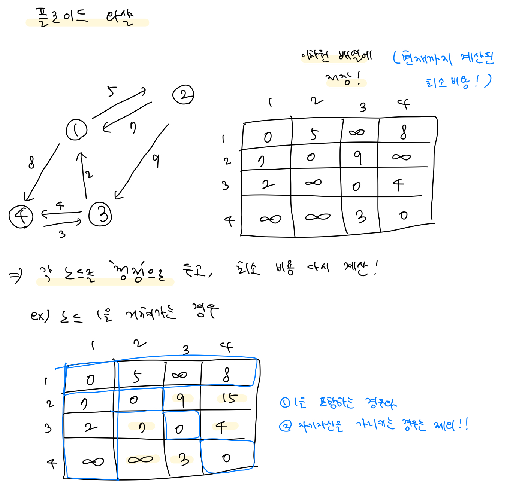
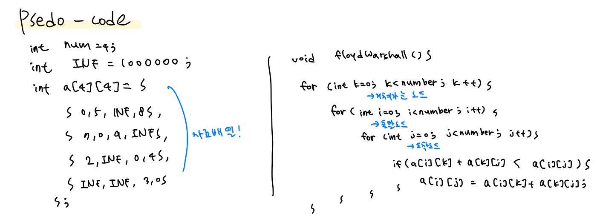

(처음 문제를 보고는 dfs를 써야하나..?라고 생각이 들었는데 알고리즘 분류에 플로이드 워셜이라고 생소한 게 있어서 공부해봤다 ㅎㅎ)

### 플로이드 워셜 알고리즘

- 그래프에서 모든 노드의 최단 거리를 구하는 알고리즘
- '모든 정점'에서 '모든 정점'으로의 최단 경로를 구할 때 사용






## [BOJ2660 / 회장뽑기]


### 문제

- 모든 사람과 친구이면 1점, 모든 사람과 친구이거나 친구의 친구이면 2점..

- 점수가 가장 적은 사람이 회장이 된다.

- 회장의 점수와 회장이 될 수 있는 후보를 오름차순으로 출력하라.

  


### 내가 생각해준 방법

- 플로이드 워셜을 사용하여 각 경로들의 최소 비용을 이중배열로 정리 후,
- 그 중에서도 각 노드들의 최대 값이, 각 사람들이 다른 사람과 가질 수 있는 최대 관계이므로, 이들을 추리고
- 그 중에서 가장 작은 값을 회장 후보가 가질 수 있는 값으로 두었다.


### 내가 짠 코드

```python
#초기값들 설정 (무한, 최소비용을 저장해줄 이중배열)
INF = 100
num = int(input())
people = [[INF]*num for _ in range(num)]

#자기자신은 0으로 초기화
for i in range(num):
    people[i][i] = 0

#이중배열 채우기
while(True):
    x, y = map(int, input().split())

    if x==-1 and y==-1:
        break

    people[x-1][y-1] = 1
    people[y-1][x-1] = 1

#각 정점을 기준으로 비교
for k in range(num):
    for i in range(num):
        for j in range(num):
            #작을수록 좋기 때문에 값이 더 작다면 값을 갱신
            if people[i][k] + people[k][j] < people[i][j]:
                people[i][j] = people[i][k] + people[k][j]

#가장 큰 값이 해당 사람이 가장 멀리까지 연결된 친구 이므로, 
#가장 큰 값을 뽑아줌
final = []
for i in range(num):
    final.append(max(people[i]))

#회장 후보의 점수
min_value = min(final)

#회장 후보
presidents = []
for i in range(num):
    if final[i] == min_value:
        presidents.append(i+1)

#정답 출력
print(min_value, len(presidents))
print(*presidents)
```
